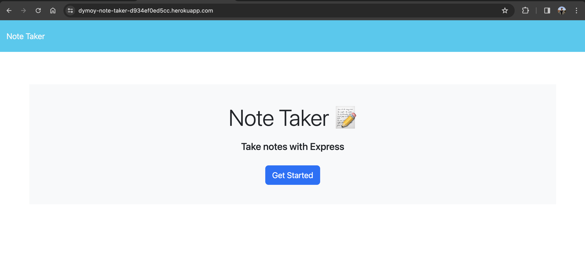
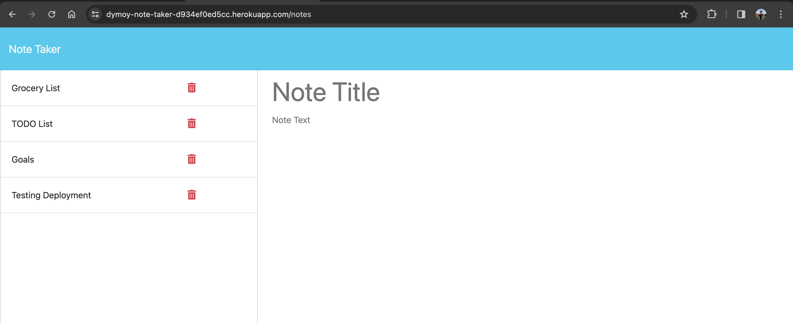
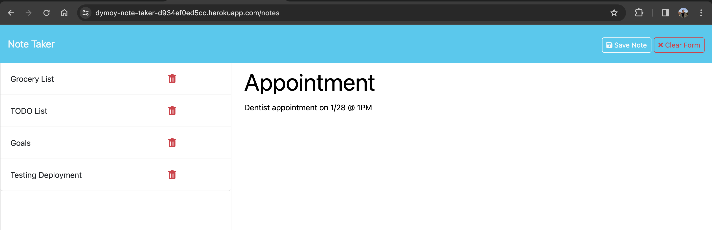
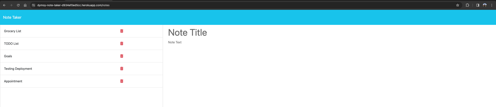
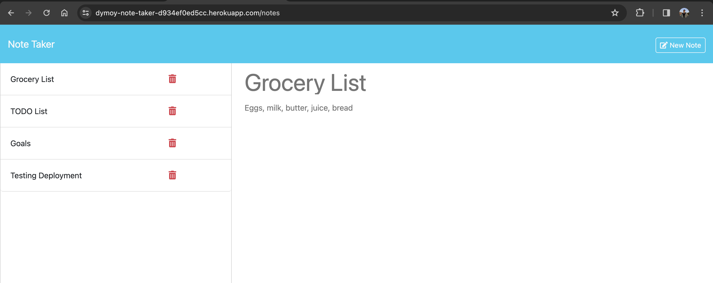
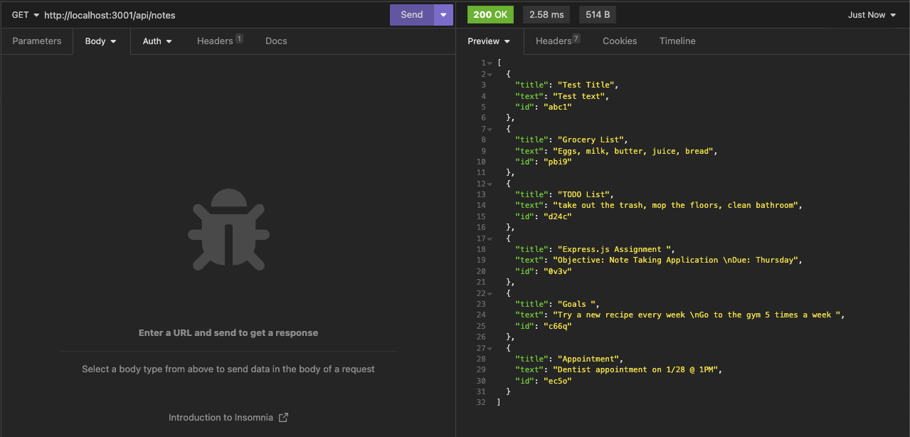
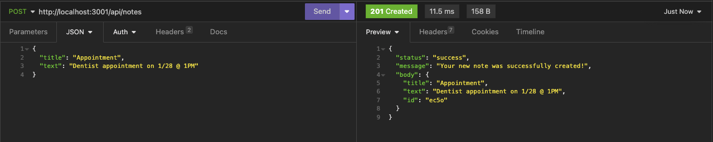
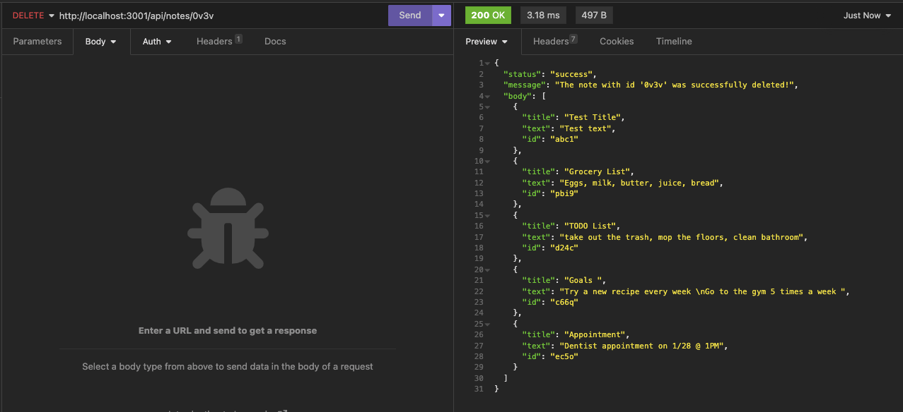

# Note Taker
[](https://opensource.org/licenses/MIT)

## Description 
This web tool is a note-taking application that allows the user to view, save, and delete notes.  

The goal of this project is to utilize the Express.js back-end framework to build API routes with Node.js and to successfully deploy the application using [Heroku](https://devcenter.heroku.com/articles/getting-started-with-nodejs). 
  
The following routes are implemented in the `routes.js` file:  
- GET API route that will send all existing notes to the client:  
`app.get('/api/notes', (req, res) => {...});`

- POST API route that will receive a new note to save on the request body, add it to the `db.json` file, and then return the new note to the client:  
`app.post('/api/notes', (req, res) => {...});`

- DELETE API route that will remove the note with the requested id paramater from the `db.json` file and then return the updated array of existing notes to the client:  
`app.delete('/api/notes/:id', (req, res) => {})`

- HTML route that returns the `notes.html` file:  
`app.get('/notes', (req, res) => {...})`

- HTML route that returns the `index.html` file:  
`app.get('*', (req, res) => {})`  

## Table of Contents 
- [Installation](#installation)
- [Dependencies](#dependencies)
- [Usage](#usage)
- [Testing](#testing)
- [Contributing](#contributing)
- [License](#license)
- [Questions](#questions)
  
## Installation 
There is no installation necessary. You can visit the deployed application [here](https://dymoy-note-taker-d934ef0ed5cc.herokuapp.com/) and try it out! This application was deployed using .

If you would like to run the application locally, use the following steps:
1. Clone this repository to your local machine. (For reference, visit the [Cloning a Repository](https://docs.github.com/en/repositories/creating-and-managing-repositories/cloning-a-repository) GitHub Docs article.)
2. Run `npm install` in your CLI to download the npm package dependencies. 
3. Run `node server.js` on your CLI to start the server.
4. Open `http://localhost:3001` in your local browser. 
  
## Dependencies
This project requires the following npm package dependencies:
1. [Express](https://www.npmjs.com/package/express)
2. [generateUniqueId](https://www.npmjs.com/package/generate-unique-id)
  
## Usage 
Once the user has opened the [note-taker](https://dymoy-note-taker-d934ef0ed5cc.herokuapp.com/) application, they will see the landing page with a button to "Get Started".  
  
  
After clicking the "Get Started" button, the user will be presented with a page that shows the existing notes listed in the left-hand column, plus empty fields to enter a new note title and the note’s text in the right-hand column.  
  
  
When the user enters a note title and note text, buttons to "Save Note" and "Clear Form" will appear at the top of the page. The "Clear Form" button will erase the entered title and text from the right-hand column.
  
  
After pressing the "Save Note" button, the newly created note appears in the left-hand column with the other existing notes, and the buttons in the navigation will disappear.  
  
  
The user can view the other existing notes by clicking on the respective note item in the left-hand column. The image below shows the user viewing the note titled "Grocery List".  
  
  
If a note is no longer needed, the user can select the red trash icon for the respective note in the left-hand column. The corresponding note will be removed from the list. 
  
## Testing 
The API routes in this application were tested with the [Insomnia](https://docs.insomnia.rest/) development platform. Please refer to the [Installation](#installation) section if you are interested in running and testing the application locally. 

### GET  

The screenshot above shows the response of the GET request to the `/api/notes` endpoint.

### POST  
  
The screenshot above shows the response of the POST request to the `/api/notes` endpoint, given the request body shown below. The id for the note is generated using the [generate-unique-id](https://www.npmjs.com/package/generate-unique-id) npm package.

```
{
	"title": "Appointment",
	"text": "Dentist appointment on 1/28 @ 1PM"
}
```
  
### DELETE  

The screenshow above shows the response of the DELETE request to the `/api/notes/:id` endpoint, given the id paramater `0v3v`.
  
## Contributing
To make contributions to this project:  
1. Fork the repository  
2. Make some commits to improve the application
3. Open a Pull Request on GitHub
4. From there, we can discuss your changes and merge the pull request once your contributions have been approved!

## License 
This GitHub repository is licensed under the MIT license. Please refer to the license documentation [here](https://opensource.org/licenses/MIT).
  
## Questions
This project was created by [dymoy](https://github.com/dymoy).  
For any related questions, please contact me via email at <derekymoy@gmail.com>.
